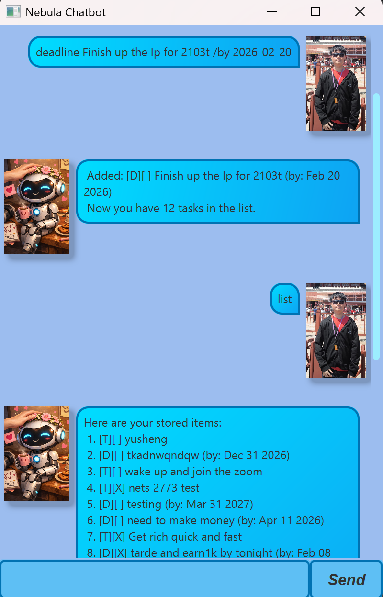

# Nebula Chatbot — User Guide

  
*Your intelligent task manager with a friendly personality*

---

## ✨ Introduction

**Nebula** is your personal AI task manager designed to help you organize daily tasks with ease. Whether you prefer typing commands in the terminal or chatting through a cozy graphical interface, Nebula adapts to your workflow while keeping your tasks safely stored between sessions.

>  *"Organizing your universe, one task at a time."* — Nebula

---

##  Getting Started

### Launch Options

| Mode | How to Launch | Best For |
|------|---------------|----------|
| **GUI (Recommended)** | Run `./gradlew run` | Visual learners who enjoy chatting with a friendly interface |
| **CLI (Terminal)** | Run `java -jar Nebula.jar` | Power users who prefer keyboard efficiency |

> **No setup required** — Nebula automatically creates a `data/` folder to save your tasks on first launch.

---

## 💬 Core Commands

All commands follow a simple pattern:  
`[command] [task details]` → Press Enter → See instant confirmation

###  Adding Tasks

#### `todo` — Simple tasks without dates
```bash
todo Read chapter 3 of textbook
```
> 💬 *Nebula replies:*  
> `Added: [T][ ] Read chapter 3 of textbook`  
> `Now you have 1 tasks in the list.`

#### `deadline` — Tasks with due dates
```bash
deadline Submit report /by 2026-02-28
```
> 💬 *Nebula replies:*  
> `Added: [D][ ] Submit report (by: Feb 28 2026)`  
> `Now you have 2 tasks in the list.`

> 📅 **Date Format**: Always use `yyyy-MM-dd` (e.g., `2026-12-31`)

#### `event` — Time-bound activities
```bash
event Project meeting /from 2026-02-20 /to 2026-02-21
```
> 💬 *Nebula replies:*  
> `Added: [E][ ] Project meeting (from: Feb 20 2026 to: Feb 21 2026)`  
> `Now you have 3 tasks in the list.`

---

###  Managing Your Tasks

#### `list` — View all tasks
```bash
list
```
> 💬 *Nebula replies:*
> ```
> Here are the tasks in your list:
>   1. [T][ ] Read chapter 3 of textbook
>   2. [D][ ] Submit report (by: Feb 28 2026)
>   3. [E][ ] Project meeting (from: Feb 20 2026 to: Feb 21 2026)
> ```

#### `mark` — Complete a task
```bash
mark 2
```
> 💬 *Nebula replies:*  
> `Marked as done: [D][X] Submit report (by: Feb 28 2026)`

#### `unmark` — Reopen a completed task
```bash
unmark 2
```
> 💬 *Nebula replies:*  
> `Marked as not done: [D][ ] Submit report (by: Feb 28 2026)`

#### `delete` — Remove a task permanently
```bash
delete 1
```
> 💬 *Nebula replies:*  
> `Deleted: [T][ ] Read chapter 3 of textbook`  
> `Now you have 2 tasks in the list.`

---

###  Finding Tasks

#### `find` — Search by keyword
```bash
find report
```
> 💬 *Nebula replies:*
> ```
> Here are the matching tasks in your list:
>   1. [D][ ] Submit report (by: Feb 28 2026)
> ```

> 💡 **Tip**: Search is case-insensitive and matches partial words (`"proj"` finds `"Project meeting"`)

---

### 📅 Rescheduling Tasks (Special Feature!)

#### `reschedule` — Change dates without recreating tasks

**For Deadlines:**
```bash
reschedule 2 /by 2026-03-15
```
> 💬 *Nebula replies:*  
> `Rescheduled: [D][ ] Submit report (by: Mar 15 2026)`

**For Events:**
```bash
reschedule 3 /from 2026-02-25 /to 2026-02-26
```
> 💬 *Nebula replies:*  
> `Rescheduled: [E][ ] Project meeting (from: Feb 25 2026 to: Feb 26 2026)`

> ⚠ **Note**: `todo` tasks cannot be rescheduled (they have no dates to change)

---

### 👋 Exiting Nebula

#### `bye` — Graceful shutdown
```bash
bye
```
> 💬 *Nebula replies:*  
> `Bye. Hope to see you again soon!`  
> *(GUI closes automatically after 1.5 seconds)*

>  **Your tasks are automatically saved** before exit — no data loss!

---

##  GUI Mode Tips

When using the graphical interface:

| Feature | How to Use |
|---------|------------|
| **Send messages** | Type command → Press Enter **or** click the blue send button |
| **View history** | Scroll up/down in the chat window to see past interactions |
| **Error highlighting** | Invalid commands appear in **red bubbles** for instant feedback |
| **Visual cues** | Your messages appear in soft blue bubbles (right side)<br>Nebula's replies appear in clean white bubbles (left side) |
| **Exit smoothly** | Type `bye` → Window closes automatically after showing farewell message |

>  **Cozy Background**: The interface features a warm, parchment-like background to reduce eye strain during late-night planning sessions.

---

##  Troubleshooting

| Issue | Solution |
|-------|----------|
| "Task number doesn't exist" | Check your task list with `list` — numbers start at **1** (not 0) |
| "Deadline must include /by" | Always use exact format: `deadline TASK /by YYYY-MM-DD` |
| Tasks disappear after restart | Ensure you see "Now you have X tasks" confirmation — tasks save automatically after every command |
| GUI shows white screen | Verify `src/main/resources/` contains:<br>- `view/MainWindow.fxml`<br>- `images/Nebula.png` and `Arthur.jpeg` |
| Date parsing errors | Use 4-digit years: `2026-02-28` (not `26-02-28`) |

---

## 🌠 Why Nebula?

-  **Zero learning curve** — Commands mimic natural language
-  **Persistent storage** — Tasks survive app restarts automatically
-  **Dual-mode flexibility** — Switch between GUI/CLI anytime
-  **Error forgiveness** — Clear messages guide you when commands fail
-  **Cosmic personality** — A chatbot that feels like a helpful friend, not a robot

---

##  License

Nebula is open-source software designed for educational purposes.  
Created with ❤️ by Arthur for CS2103T Independent Project.